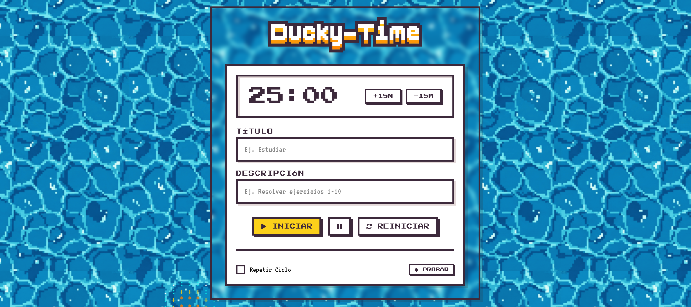

# 🐤 Ducky-Time

**Ducky-Time** es un temporizador estilo Pomodoro con notificaciones nativas del sistema operativo, diseñado con una estética pixel art.



---

## ✨ Características

- ⏱️ **Temporizador personalizable**: Ingresa el tiempo manualmente en formato `MM:SS` o usa los botones `+15m` / `-15m`.
- 🔔 **Notificaciones nativas**: Recibe alertas del sistema cuando el tiempo termine (funciona incluso con la pestaña en segundo plano).
- 🔁 **Modo Repetir Ciclo**: Reinicia automáticamente el temporizador cuando termina.
- 📝 **Título y descripción**: Personaliza el nombre de tu sesión de estudio.
- 🦆 **Fondo interactivo**: Canvas animado con efectos ASCII que reaccionan al mouse.

---

## 🛠️ Tecnologías Utilizadas

| Tecnología | Uso |
|------------|-----|
| **HTML5** | Estructura de la aplicación |
| **SASS/SCSS** | Estilos modulares con variables CSS |
| **JavaScript (ES6+)** | Lógica del temporizador y notificaciones |
| **Service Worker** | Notificaciones confiables en segundo plano |
| **Canvas API** | Efecto visual del fondo animado |
| **Google Fonts** | Fuentes `Press Start 2P` y `VT323` |
| **Pixel Icon Library** | Íconos pixelados (@hackernoon) |

---

## 📁 Estructura del Proyecto

```
Duck-Buddy/
├── assets/
│   ├── icons/pixel-icons/    # Fuentes de íconos
│   ├── img/                  # Imágenes y fondos
│   └── svg/                  # Logo vectorial
├── css/
│   └── main.css              # CSS compilado
├── sass/
│   ├── abstracts/            # Variables y mixins
│   ├── base/                 # Reset y root variables
│   ├── components/           # Botones, inputs, timer, modal
│   └── layout/               # Header, panels, layout
├── js/
│   ├── app.js                # Inicialización y Service Worker
│   ├── timer.js              # Clase StudyTimer
│   └── canvas.js             # Efecto ASCII del fondo
├── index.html                # Página principal
├── sw.js                     # Service Worker
├── start.bat                 # Script de inicio (Windows)
├── start.sh                  # Script de inicio (macOS/Linux)
└── package.json              # Dependencias
```

---

## 🚀 Instrucciones de Uso

### 1. Clonar o descargar el proyecto

```bash
git clone https://github.com/tu-usuario/ducky-time.git
cd ducky-time
```

### 2. Instalar dependencias

```bash
npm install
```

### 3. Compilar SASS (opcional, si modificas estilos)

```bash
npx sass sass/main.scss css/main.css --watch
```

### 4. Ejecutar con un servidor local

La aplicación requiere un servidor HTTP para que el Service Worker funcione correctamente.

**🚀 Opción Rápida - Scripts incluidos:**

El proyecto incluye scripts que inician automáticamente un servidor Python y abren el navegador:

- **Windows**: Doble clic en `start.bat`
- **macOS/Linux**: Ejecuta `./start.sh` en la terminal

> ⚠️ Requiere Python instalado en el sistema.

---

**Opciones alternativas:**

**Opción A - Con Live Server (VS Code):**
- Instala la extensión "Live Server" en VS Code.
- Haz clic derecho en `index.html` → "Open with Live Server".

**Opción B - Con Python (manual):**
```bash
python -m http.server 8000
```
Luego abre `http://localhost:8000` en tu navegador.

**Opción C - Con Node.js:**
```bash
npx serve .
```

### 5. Permitir notificaciones

Al abrir la aplicación por primera vez, aparecerá un modal solicitando permiso para enviar notificaciones. Haz clic en **"ACTIVAR NOTIFICACIONES"**.

---

## 🎮 Cómo Funciona

1. **Configura el tiempo**: Escribe directamente en el campo (ej: `25:00`) o usa los botones.
2. **Agrega título/descripción** (opcional): Para personalizar la notificación.
3. **Presiona INICIAR**: El contador comenzará.
4. **Activa "Repetir Ciclo"** (opcional): El temporizador se reiniciará automáticamente al terminar.
5. **Recibe la notificación**: Cuando el tiempo llegue a cero, recibirás una alerta del sistema.

---

## 📄 Fundamento metodología BEM y elección de preprocesador SASS

Se eligió BEM porque es una metodología que permite una mejor organización del código y una mejor legibilidad, ya que, al usar bloque__elemento--modificador, se puede identificar claramente la jerarquía y la relación entre los elementos.

Por otro lado, se eligió SASS como preprocesador porque es un preprocesador que permite una mejor organización a la hora de buscar partes individuales del código, muy útil en caso de que se quiera reutilizar en otro proyecto, aunque se demora en establecer el orden vale la pena a largo plazo.